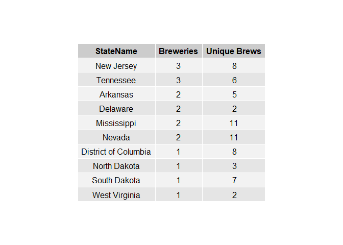
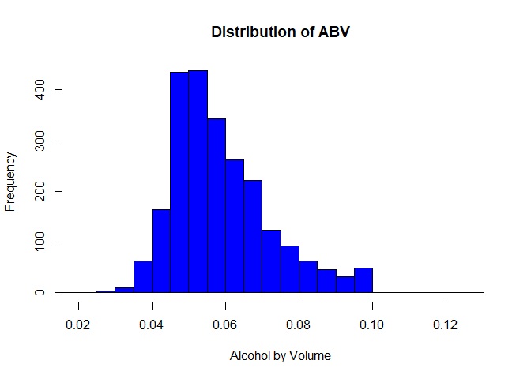
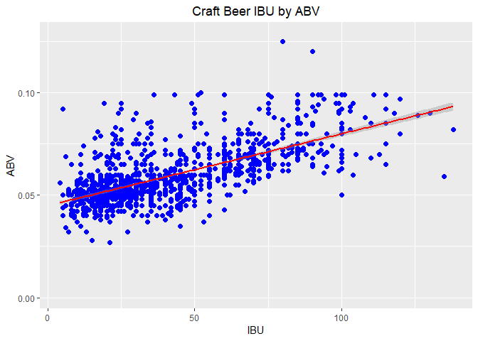
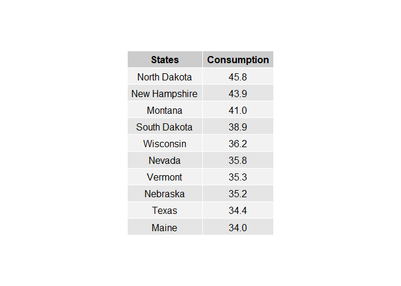

## XYZ Brewery Proposal

### Introduction
According to [Fortune](http://fortune.com/2018/03/27/craft-beer-2017-sales/) the US Craft Brew industry was worth $26 billion dollars in 2017, an increase of $6.2 billion since 2015.  While the pace of growth is slowing, opportunity is still large.  It's known that craft beer drinkers tend to support local independent breweries, and consumers are becoming more selective.  Furthermore there is [rising demand](https://www.grandviewresearch.com/press-release/global-craft-beer-market) for low alcohol by volume (ABV) and flavored beer.  Each market share of .5%  is equivalent to $130 million in revenue.

As a startup XYZ faces a saturated market.  There are two purposes of this research, first of which is to examine the current landscape and scope out underserved areas in the US where few breweries exist.   Second is to understand what beer preference(s) would be most profitable should a brewery (or breweries) be built.  [Craftbeer](https://www.craftbeer.com/craft-beer-muses/craft-beer-by-the-numbers) reports that four key statistics are used to describe craft beers:

**1)** Serving size

**2)** International Bitterness Units (IBU): the bitterness element of a beer's flavor

**3)** Alcohol by Volume (ABV): higher values increase the complexity and flavor of the beer

**4)** Original Gravity / Final Gravity: factors which affect ABV and sensory intensity

This report will focus on IBU and ABV. 

### Competitive Landscape: How many craft breweries are currently producing in the US?

Working with *Beers.csv* and *Breweries.csv*, first load each file into R (after setting a working a directory) and load any needed libraries.

```r
knitr::opts_chunk$set(echo = TRUE)
## obtain data needed to evaluate competitive landscape and load into R
getwd()
```

```
## [1] "C:/Users/jhold/Desktop/case study 1"
```

```r
setwd("c:/Users/jhold/Desktop/case study 1")
library(tidyverse)
```

```
## -- Attaching packages ---------------------------------------------------------------------------------------------------------------------------- tidyverse 1.2.1 --
```

```
## v ggplot2 3.1.0     v purrr   0.2.5
## v tibble  1.4.2     v dplyr   0.7.6
## v tidyr   0.8.1     v stringr 1.3.1
## v readr   1.1.1     v forcats 0.3.0
```

```
## -- Conflicts ------------------------------------------------------------------------------------------------------------------------------- tidyverse_conflicts() --
## x dplyr::filter() masks stats::filter()
## x dplyr::lag()    masks stats::lag()
```
The data on beers is read as a *csv* file and is called *beers*.
```r
beers <- read_csv("c:/Users/jhold/Desktop/case study 1/Beers.csv")
```

```
## Parsed with column specification:
## cols(
##   Name = col_character(),
##   Beer_ID = col_integer(),
##   ABV = col_double(),
##   IBU = col_integer(),
##   Brewery_id = col_integer(),
##   Style = col_character(),
##   Ounces = col_double()
## )
```
The same process applies to the *Brewers.csv* file, and it is called *brewers*.
```r
brewers <- read_csv("c:/Users/jhold/Desktop/case study 1/Breweries.csv")
```

```
## Parsed with column specification:
## cols(
##   Brew_ID = col_integer(),
##   Name = col_character(),
##   City = col_character(),
##   State = col_character()
## )
```
The total number of brewers can be found by inspecting the ```State``` column in the *brewers*.  There are 558 unique breweries in the US.
```r
length(brewers$State)
```

```
## [1] 558
```
### Combining data sources to better understand craft brewering in US

By merging the *beers* and *brewers* datasets, a more complete picture of the US beer landscape is possible.  Each dataset will be merged on their common *id* columns.  This is ```Brewery_id``` and ```Brew_ID```, which are equivalent.

The first and last 6 observations can be examined instead of displaying the over 2000 rows in the combined dataset.


```r
knitr::opts_chunk$set(echo = TRUE)
# fully analyze data by combining different data sets
Brewtot <- merge(beers, brewers, by.x = "Brewery_id", by.y = "Brew_ID")
# check integrity of combined files and evaluate variable features
head(Brewtot,6)
```

```
##   Brewery_id        Name.x Beer_ID   ABV IBU
## 1          1  Get Together    2692 0.045  50
## 2          1 Maggie's Leap    2691 0.049  26
## 3          1    Wall's End    2690 0.048  19
## 4          1       Pumpion    2689 0.060  38
## 5          1    Stronghold    2688 0.060  25
## 6          1   Parapet ESB    2687 0.056  47
##                                 Style Ounces            Name.y        City
## 1                        American IPA     16 NorthGate Brewing Minneapolis
## 2                  Milk / Sweet Stout     16 NorthGate Brewing Minneapolis
## 3                   English Brown Ale     16 NorthGate Brewing Minneapolis
## 4                         Pumpkin Ale     16 NorthGate Brewing Minneapolis
## 5                     American Porter     16 NorthGate Brewing Minneapolis
## 6 Extra Special / Strong Bitter (ESB)     16 NorthGate Brewing Minneapolis
##   State
## 1    MN
## 2    MN
## 3    MN
## 4    MN
## 5    MN
## 6    MN
```

```r
tail(Brewtot,6)
```

```
##      Brewery_id                    Name.x Beer_ID   ABV IBU
## 2405        556             Pilsner Ukiah      98 0.055  NA
## 2406        557  Heinnieweisse Weissebier      52 0.049  NA
## 2407        557           Snapperhead IPA      51 0.068  NA
## 2408        557         Moo Thunder Stout      50 0.049  NA
## 2409        557         Porkslap Pale Ale      49 0.043  NA
## 2410        558 Urban Wilderness Pale Ale      30 0.049  NA
##                        Style Ounces                        Name.y
## 2405         German Pilsener     12         Ukiah Brewing Company
## 2406              Hefeweizen     12       Butternuts Beer and Ale
## 2407            American IPA     12       Butternuts Beer and Ale
## 2408      Milk / Sweet Stout     12       Butternuts Beer and Ale
## 2409 American Pale Ale (APA)     12       Butternuts Beer and Ale
## 2410        English Pale Ale     12 Sleeping Lady Brewing Company
##               City State
## 2405         Ukiah    CA
## 2406 Garrattsville    NY
## 2407 Garrattsville    NY
## 2408 Garrattsville    NY
## 2409 Garrattsville    NY
## 2410     Anchorage    AK
```

### Market Saturation

In determining where to build any brewery, it's advisable to avoid states with many breweries already.  To that end, the merged dataset ```Brewtot``` can be used to summarize the total number of unique brews and brewers per state.
```r
### Determine market saturation by state for breweries and beers brewed
library(plyr)
```

```
## -------------------------------------------------------------------------
```

```
## You have loaded plyr after dplyr - this is likely to cause problems.
## If you need functions from both plyr and dplyr, please load plyr first, then dplyr:
## library(plyr); library(dplyr)
```

```
## -------------------------------------------------------------------------
```

```
## 
## Attaching package: 'plyr'
```

```
## The following objects are masked from 'package:dplyr':
## 
##     arrange, count, desc, failwith, id, mutate, rename, summarise,
##     summarize
```

```
## The following object is masked from 'package:purrr':
## 
##     compact
```

```r
BrewersbyState <- brewers$State
CntState <- count(brewers$State)
cntbeers <- count(Brewtot$State)
df <- merge(CntState,cntbeers, by.x ='x', by.y='x')
names(df) <- c("State", "Breweries", "Unique Brews")
library (openintro)
```

```
## Please visit openintro.org for free statistics materials
```

```
## 
## Attaching package: 'openintro'
```

```
## The following object is masked from 'package:ggplot2':
## 
##     diamonds
```

```
## The following objects are masked from 'package:datasets':
## 
##     cars, trees
```

```r
library(gridExtra)
```

```
## 
## Attaching package: 'gridExtra'
```

```
## The following object is masked from 'package:dplyr':
## 
##     combine
```

```r
library(grid)
df$StateName <- abbr2state(df$State) 
df <- df[order(-df$Breweries),] 

```

### Top 10 Brewery States

```r
knitr::opts_chunk$set(echo = TRUE)

dfh <-df[1:10,c(4,2,3)]
grid.table(dfh,rows = NULL)
```

<!-- -->

### Bottom 10 Brewery States
```r
knitr::opts_chunk$set(echo = TRUE)
dfl <-df[42:51,c(4,2,3)]  
grid.table(dfl,rows=NULL)
```

<!-- -->

### Evaluate for missing data points

Before further commenting, the limitations of this data needs pointing out.  Over 1005 IBU and 62 ABV values are missing - pertinent info that, though unlikely, may impact the magnitude of our results.  Nevertheless this will be ignored given the breadth of the dataset.


```r
knitr::opts_chunk$set(echo = TRUE)

MissTot <- sapply(Brewtot, function(x) sum(is.na(x)))
MissTot
```

```
## Brewery_id     Name.x    Beer_ID        ABV        IBU      Style 
##          0          0          0         62       1005          5 
##     Ounces     Name.y       City      State 
##          0          0          0          0
```

```r
# IBU's have a high rate of missing data which may effect analyses of these data points
```


### Regional differences in beer characteristics
Median Alcohol by Volume (ABV) and median International Bitterness Unit (IBU) can inform market researchers about the characteristics of craft beers and the the nature of beer brewing in the US market.  

```r
knitr::opts_chunk$set(echo = TRUE)

MedA<- aggregate (Brewtot$ABV, list(Brewtot$State), median, na.rm=TRUE)
MedI <- aggregate (Brewtot$IBU, list(Brewtot$State), median, na.rm=TRUE)

MedA
```

```
##    Group.1      x
## 1       AK 0.0560
## 2       AL 0.0600
## 3       AR 0.0520
## 4       AZ 0.0550
## 5       CA 0.0580
## 6       CO 0.0605
## 7       CT 0.0600
## 8       DC 0.0625
## 9       DE 0.0550
## 10      FL 0.0570
## 11      GA 0.0550
## 12      HI 0.0540
## 13      IA 0.0555
## 14      ID 0.0565
## 15      IL 0.0580
## 16      IN 0.0580
## 17      KS 0.0500
## 18      KY 0.0625
## 19      LA 0.0520
## 20      MA 0.0540
## 21      MD 0.0580
## 22      ME 0.0510
## 23      MI 0.0620
## 24      MN 0.0560
## 25      MO 0.0520
## 26      MS 0.0580
## 27      MT 0.0550
## 28      NC 0.0570
## 29      ND 0.0500
## 30      NE 0.0560
## 31      NH 0.0550
## 32      NJ 0.0460
## 33      NM 0.0620
## 34      NV 0.0600
## 35      NY 0.0550
## 36      OH 0.0580
## 37      OK 0.0600
## 38      OR 0.0560
## 39      PA 0.0570
## 40      RI 0.0550
## 41      SC 0.0550
## 42      SD 0.0600
## 43      TN 0.0570
## 44      TX 0.0550
## 45      UT 0.0400
## 46      VA 0.0565
## 47      VT 0.0550
## 48      WA 0.0555
## 49      WI 0.0520
## 50      WV 0.0620
## 51      WY 0.0500
```

```r
MedI
```

```
##    Group.1    x
## 1       AK 46.0
## 2       AL 43.0
## 3       AR 39.0
## 4       AZ 20.5
## 5       CA 42.0
## 6       CO 40.0
## 7       CT 29.0
## 8       DC 47.5
## 9       DE 52.0
## 10      FL 55.0
## 11      GA 55.0
## 12      HI 22.5
## 13      IA 26.0
## 14      ID 39.0
## 15      IL 30.0
## 16      IN 33.0
## 17      KS 20.0
## 18      KY 31.5
## 19      LA 31.5
## 20      MA 35.0
## 21      MD 29.0
## 22      ME 61.0
## 23      MI 35.0
## 24      MN 44.5
## 25      MO 24.0
## 26      MS 45.0
## 27      MT 40.0
## 28      NC 33.5
## 29      ND 32.0
## 30      NE 35.0
## 31      NH 48.5
## 32      NJ 34.5
## 33      NM 51.0
## 34      NV 41.0
## 35      NY 47.0
## 36      OH 40.0
## 37      OK 35.0
## 38      OR 40.0
## 39      PA 30.0
## 40      RI 24.0
## 41      SC 30.0
## 42      SD   NA
## 43      TN 37.0
## 44      TX 33.0
## 45      UT 34.0
## 46      VA 42.0
## 47      VT 30.0
## 48      WA 38.0
## 49      WI 19.0
## 50      WV 57.5
## 51      WY 21.0
```

South Dakota has no information on IBU, so it will be removed.  Future research will be done to determine a median value.  After removing South Dakota, the IBU and ABV distributions will be examined.

```r
#### South Dakota is missing IBU data and will be dropped as a data point
MedI <- MedI[-c(42),]
## evaluate the frequency distributions of ABV and IBU 
hist(Brewtot$ABV, main="Distribution of ABV", breaks=20, xlab="Alcohol by Volume", border="black", col="blue", xlim=c(.02,.13)) 
```

<!-- -->

```r
hist(Brewtot$IBU, main="Distribution of IBU", breaks=20, xlab="International Bitterness Units", border="black", col="red", xlim=c(0,100))
```

<!-- -->

Both ABV and IBU are right skewed. Most brews have a low to moderate IBU and ABV while a subset of beers are high in ABV and/or IBU.

For a more granular view, median ABV and median IBU is plotted according to state,,
```r
## Evaluate beer characteristics by state to determine if thwere any regional effects to consider
ggplot(data=MedA, aes(x=reorder(Group.1, x), y=x, fill=Group.1)) +geom_bar(stat="identity") +coord_flip() +ylab("Median ABV") + xlab("State Name") +ggtitle("Median ABV by State")+ theme(plot.title = element_text(hjust = 0.5)) + theme(legend.position="none")
```

<!-- -->

```r
ggplot(data=MedI, aes(x=reorder(Group.1, x), y=x, fill=Group.1)) +geom_bar(stat="identity") +coord_flip() +ylab("Median IBU") + xlab("State Name") +ggtitle("Median IBU by State")+ theme(plot.title = element_text(hjust = 0.5)) + theme(legend.position="none")
```

<!-- -->

There isn't much variation on median ABV, presumably for obvious health reasons, but there is a sharp contrast in median IBU levels by state.  Maine's median beer IBU is nearly three times higher than Wisconsin's.

```r
## Evaluate alcohol level
Brewtot <- Brewtot[order(-Brewtot$ABV),] 
##Most alcohol by volume beer is Colorado
head(Brewtot,1)
```

```
##     Brewery_id                                               Name.x
## 375         52 Lee Hill Series Vol. 5 - Belgian Style Quadrupel Ale
##     Beer_ID   ABV IBU            Style Ounces                  Name.y
## 375    2565 0.128  NA Quadrupel (Quad)   19.2 Upslope Brewing Company
##        City State
## 375 Boulder    CO
```

```r
## highest 5 and lowest 5 state median abv's
MedA <- MedA[order(-MedA$x),] 
names(MedA) <- c("State", "ABV")
head(MedA,5)
```

```
##    State    ABV
## 8     DC 0.0625
## 18    KY 0.0625
## 23    MI 0.0620
## 33    NM 0.0620
## 50    WV 0.0620
```

```r
tail(MedA,5)
```

```
##    State   ABV
## 17    KS 0.050
## 29    ND 0.050
## 51    WY 0.050
## 32    NJ 0.046
## 45    UT 0.040
```

```r
## basic statistics for ABV use pastecs for standard deviation and to check standard error of the mean
library(pastecs)
```

```
## 
## Attaching package: 'pastecs'
```

```
## The following objects are masked from 'package:dplyr':
## 
##     first, last
```

```
## The following object is masked from 'package:tidyr':
## 
##     extract
```

```r
options(scipen=100)
stat.desc(Brewtot$ABV)
```

```
##         nbr.val        nbr.null          nbr.na             min 
## 2348.0000000000    0.0000000000   62.0000000000    0.0010000000 
##             max           range             sum          median 
##    0.1280000000    0.1270000000  140.3480000000    0.0560000000 
##            mean         SE.mean    CI.mean.0.95             var 
##    0.0597734242    0.0002794636    0.0005480212    0.0001833786 
##         std.dev        coef.var 
##    0.0135417337    0.2265510785
```

```r
### Evaluate IBU level
Brewtot <- Brewtot[order(-Brewtot$IBU),] 
## Most bitter beer by IBU is brewed in 
head(Brewtot,1)
```

```
##      Brewery_id                    Name.x Beer_ID   ABV IBU
## 1857        375 Bitter Bitch Imperial IPA     980 0.082 138
##                               Style Ounces                  Name.y    City
## 1857 American Double / Imperial IPA     12 Astoria Brewing Company Astoria
##      State
## 1857    OR
```

```r
## highest 5 and lowest 5 state median IBU's
MedI <- MedI[order(-MedI$x),] 
names(MedI) <- c("State", "IBU")
head(MedI,5)
```

```
##    State  IBU
## 22    ME 61.0
## 50    WV 57.5
## 10    FL 55.0
## 11    GA 55.0
## 9     DE 52.0
```

```r
tail(MedI,5)
```

```
##    State  IBU
## 12    HI 22.5
## 51    WY 21.0
## 4     AZ 20.5
## 17    KS 20.0
## 49    WI 19.0
```

```r
stat.desc(Brewtot$IBU)
```

```
##       nbr.val      nbr.null        nbr.na           min           max 
##  1405.0000000     0.0000000  1005.0000000     4.0000000   138.0000000 
##         range           sum        median          mean       SE.mean 
##   134.0000000 60012.0000000    35.0000000    42.7131673     0.6924162 
##  CI.mean.0.95           var       std.dev      coef.var 
##     1.3582818   673.6135373    25.9540659     0.6076362
```

#### Relationship between ABV and IBU

A scatterplot of ABV and IBU is utilized to determine any correlation between these two quantities 

```r
knitr::opts_chunk$set(echo = TRUE)

### plot of ABV by IBU
ggplot(data=Brewtot, aes(x=IBU, y=ABV)) +geom_point(shape = 16, size = 2, color="blue") + stat_smooth(method = 'lm', color='red') + labs(title = 'Craft Beer IBU by ABV') + theme(plot.title = element_text(hjust = 0.5))
```

```
## Warning: Removed 1005 rows containing non-finite values (stat_smooth).
```

```
## Warning: Removed 1005 rows containing missing values (geom_point).
```

<!-- -->

A moderate linear correlation is visible.  A Pearson correlation test quantifies it.  

```r
### correlation test of limear relationship
cor.test( ~ ABV + IBU,data=Brewtot,method = "pearson")
```

```
## 
## 	Pearson's product-moment correlation
## 
## data:  ABV and IBU
## t = 33.863, df = 1403, p-value < 0.00000000000000022
## alternative hypothesis: true correlation is not equal to 0
## 95 percent confidence interval:
##  0.6407982 0.6984238
## sample estimates:
##       cor 
## 0.6706215
```
At *r* = 0.67, this is indeed moderately, but not strong, positive correlation.  The regression line illustrates that the variability may be changing along the prediction line (heteroscedasticity).  This is exemplified by the fact that beers of 5% ABV or lower tend to have low to moderate IBU and not high levels of IBU.  However, at ABV of 7.5 and higher, you get a full range of IBU's meaning that it is possible to have high ABV low IBU beers.  This correlation does not show causation as the relationship may be affect by third variables such as ingredients used, fermentaiton process, and marketing needs.
     
### Integrating beer consumption data to understand drinking habits

Additional [data](http://scottjanish.com/map-per-capita-gallons-beer-consumed-per-adult-state) is helpful in understanding which states are heavy drinkers on average, and can be used to examine if higher consumption relates to more breweries for any given state.

```r
knitr::opts_chunk$set(echo = TRUE)
### scraping web data on consumption
library(XML)
library(rvest)
```

```
## Loading required package: xml2
```

```
## 
## Attaching package: 'rvest'
```

```
## The following object is masked from 'package:XML':
## 
##     xml
```

```
## The following object is masked from 'package:purrr':
## 
##     pluck
```

```
## The following object is masked from 'package:readr':
## 
##     guess_encoding
```

```r
dr1=html('http://scottjanish.com/map-per-capita-gallons-beer-consumed-per-adult-state')
```

```
## Warning: 'html' is deprecated.
## Use 'read_html' instead.
## See help("Deprecated")
```

```r
drinks  <- dr1 %>%  html_nodes("td") %>% html_text()
str(drinks)
```

```
##  chr [1:102] "Alabama" "30.2" "Alaska" "28.7" "Arizona" "29.5" ...
```

```r
x <- seq(1,101,2)
States <- drinks[x]
y <- seq(2,102,2)
Consumption <- as.numeric(drinks[y])
dr2<-dplyr::data_frame(States,Consumption)
str(dr2)
```

```
## Classes 'tbl_df', 'tbl' and 'data.frame':	51 obs. of  2 variables:
##  $ States     : chr  "Alabama" "Alaska" "Arizona" "Arkansas" ...
##  $ Consumption: num  30.2 28.7 29.5 26.7 25.5 30 22.1 33.6 28.3 27.4 ...
```

```r
dr2$State <- state2abbr(dr2$States) 
dr2 <- dr2[order(-dr2$Consumption),] 
head(dr2)
```

```
## # A tibble: 6 x 3
##   States        Consumption State
##   <chr>               <dbl> <chr>
## 1 North Dakota         45.8 ND   
## 2 New Hampshire        43.9 NH   
## 3 Montana              41   MT   
## 4 South Dakota         38.9 SD   
## 5 Wisconsin            36.2 WI   
## 6 Nevada               35.8 NV
```

```r
tail(dr2)
```

```
## # A tibble: 6 x 3
##   States      Consumption State
##   <chr>             <dbl> <chr>
## 1 Kentucky           24.4 KY   
## 2 Maryland           23.2 MD   
## 3 New Jersey         22.4 NJ   
## 4 New York           22.4 NY   
## 5 Connecticut        22.1 CT   
## 6 Utah               20.2 UT
```

```r
drh <- dr2[1:10,c(1,2)]
drl <- dr2[42:51,c(1,2)]
```

Montana is regionally close, but notable is North and South Dakota.  In spite of their high consumption, they rank near the bottom in terms of number of brewers.

```r
knitr::opts_chunk$set(echo = TRUE)
grid.table(drh,rows = NULL)
```

<!-- -->

### Conclusion

This research demonstrates a variety of beer tastes exist within the US.  Colorado is the most diverse in terms of beer types and breweries, with West Virigia taking last place in those categories.

We propose building a brewery on the North/South Dakota border.  A suitable location may be Strasburg.  This brewery will develop a line of craft beers called 'Dakotas' with a higher median ABV for North Dakota and lower median ABV for their southern brethren. A lower Median IBU is advisible for the North Dakota; further inquiry will be made on IBU info for South Dakota.  

Three initial offerings would garner local brand attachment:
* Higher ABV with lower IBU  Dakotas White Out
* Moderate ABV with moderate IBU Dakotas Road Plow Blast
* Moderate ABV with lower IBU Dakota Winter Nights

The goal is to gain a regional adoption of at least 40% within five years.  
